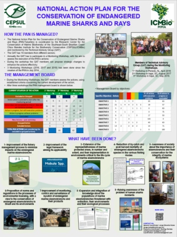
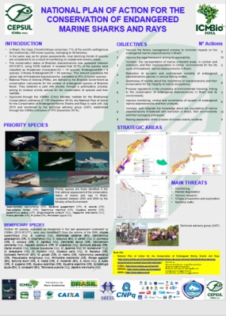
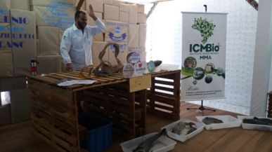
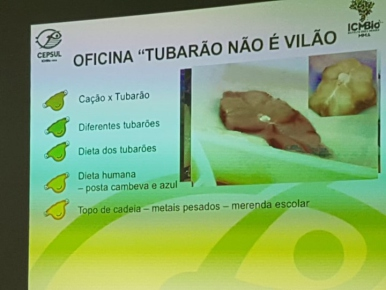
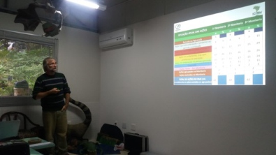
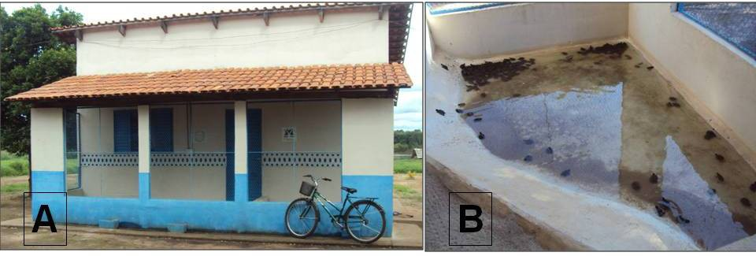

# Validação do piloto de processamento de imagens (Fase 2.3)

**Data:** 2026-08-10
**Escopo desta rodada:** apenas a etapa de classificação (CLIP), via `testar_classificacao.py`. A etapa de descrição com VLM local (Qwen2-VL-2B-Instruct, `processar_imagens_piloto.py`) ainda não foi validada — ver [Pendências](#pendências).

## Contexto

O piloto (`scripts/processamento_imagens/`) estava implementado, mas nunca tinha sido rodado com sucesso em um PDF real. Esta sessão fez a primeira validação: 6 PDFs testados, cobrindo Monitora, PANs (relatório, portaria, cartaz) e uma publicação científica (TCC).

## Bug encontrado e corrigido

`page.get_images()` (PyMuPDF) retorna uma lista de tuplas `(xref, smask, largura, altura, bpc, colorspace, ...)`, mas o código tratava cada tupla como se já fosse o `xref` (inteiro) e passava direto para `doc.extract_image()`. Resultado: **toda extração de imagem falhava, em qualquer PDF**, com erro `'<=' not supported between instances of 'int' and 'tuple'`, mascarado como "0 imagens encontradas".

Corrigido em dois arquivos, extraindo `xref = img_info[0]`:
- `scripts/processamento_imagens/testar_classificacao.py`
- `scripts/processamento_imagens/processar_imagens_piloto.py`

Sem essa correção, nenhuma imagem jamais teria sido processada — vale conferir se algum resultado anterior (se houver) não estava mascarando esse erro como "PDF sem imagens".

## Ambiente dos testes

- CPU forçada (`CUDA_VISIBLE_DEVICES=""`) porque a GPU (RTX 2050, 4GB) estava ocupada em 100% pela indexação de embeddings (BGE-M3) rodando em paralelo (Fase 5.3).
- Modelo: `openai/clip-vit-base-patch32`.
- Classes candidatas: gráfico, mapa, diagrama, tabela (relevantes) vs. fotografia, ilustração (descartadas).

## Resultados por PDF

| PDF | Fonte | Threshold | Imagens extraídas | Relevantes | Taxa |
|---|---|---|---|---|---|
| `2018-pan-tubaroes-boletim-1.pdf` | pans/pan-tubaroes | 0.5 | 11 | 3 | 27.3% |
| `2023-pan-aves-marinhas-2-4-cartaz-procurado-sula-sula-ilha-da-trindade.pdf` | pans/pan-aves-marinhas | 0.4 | 10 | 2 | 20.0% |
| `2022-pan-portaria-gat.pdf` | pans/pan-tartarugas-marinhas | 0.4 | 0 | — | — (documento administrativo, sem imagens embutidas — esperado) |
| `2025-pan-sauim-de-coleira-corredor-taruma-ponta-negra.pdf` | pans/pan-sauim-de-coleira | 0.4 | 11 | 11 | 100% |
| `livro_monitoramento_participativo_da_biodiversidade.pdf` | monitora/livros | 0.4 | 213 | 165 | 77.5% |
| `4 - Natália Yoshimura Lopes, 2012.pdf` (TCC) | publicações científicas | 0.4 | 133 | 114 | 85.7% |

Relatórios JSON completos ficaram em pastas temporárias da sessão (não persistem). As imagens discutidas nos achados abaixo foram salvas em [`imagens_validacao_piloto/`](imagens_validacao_piloto/).

## Checagem visual manual (método)

Rodar com `--save-images --output <pasta>` salva cada imagem extraída como `img_{idx}_p{página}_{classe}.png`, permitindo abrir e comparar com a classificação/confiança do CLIP no JSON. Usado para revisar os casos de confiança baixa/limítrofe (faixa ~0.35–0.55, onde os erros se concentram).

### Achado 1 — Falso negativo confirmado (threshold 0.5)

No PDF do PAN Tubarões, dois pôsteres da mesma família de documento (mesmo estilo, ambos com mapa + texto estruturado):
- item #9 — "HOW THE PAN IS MANAGED" — **gráfico 78.2%** → mantido corretamente.

  

- item #11 — "NATIONAL PLAN OF ACTION FOR THE CONSERVATION OF ENDANGERED MARINE SHARKS AND RAYS" (mapa + espécies prioritárias + ameaças) — **gráfico 48.5%** → descartado por 1.5 ponto do threshold de 0.5, apesar de ter conteúdo equivalente (e valioso) ao item mantido.

  

Conclusão: threshold 0.5 é agressivo demais para pôsteres/infográficos compostos — o CLIP tem ruído real bem em cima desse valor para esse tipo de imagem.

Outros itens do mesmo PDF, revisados para calibração (fora da faixa limítrofe, comportamento correto):

| Item | Classe/confiança | Imagem | Avaliação |
|---|---|---|---|
| #4 — foto de pessoa numa bancada | fotografia 34.3% |  | ✅ descarte correto |
| #2 — slide "Oficina Tubarão não é vilão" | gráfico 38.1% |  | ✅ descarte razoável (decorativo, pouco dado extraível) |
| #8 — elemento quase em branco | diagrama 46.2% (arquivo de <1KB) |  | ✅ ruído (marca d'água atrás do pôster), descarte correto |
| #1 — foto de pessoa apresentando slide com tabela | diagrama 47.5% |  | limítrofe — é principalmente uma foto de sala/pessoa, mas tem uma tabela de dados visível ao fundo; descarte defensável |

### Achado 2 — Falsos positivos com threshold 0.4: logos pequenos

No cartaz do PAN Aves Marinhas, dois itens pequenos (126x102 e 117x121 px) foram classificados como "tabela" (41.3% e 54.9%) e marcados relevantes — mas são, na verdade, **logos institucionais** (marca d'água "ReBio" e logo "NUPEM/UFRJ Macaé"), sem valor de conteúdo.

| Logo "ReBio" (tabela 41.3%) | Logo "NUPEM/UFRJ" (tabela 54.9%) |
|---|---|
|  |  |

O filtro de tamanho mínimo atual (`width >= 100 and height >= 100`) não é suficiente para excluir esses casos, pois logos pequenos costumam ficar pouco acima desse limiar. **Recomendação:** subir o mínimo (ex.: 150x150) e/ou considerar heurística adicional (ex.: descartar imagens muito próximas do canto da página, ou com poucas cores/baixa entropia, típico de logos).

### Achado 3 — Mesma imagem extraída em páginas diferentes (duplicação)

Na TCC (Natália Yoshimura Lopes, 2012), a mesma figura composta (foto A: prédio com bicicleta; foto B: viveiro de quelônios) aparece **idêntica** nas páginas 18 e 19 do relatório de classificação (mesma distribuição de confiança, mesmo tamanho). Confirmado visualmente que é a mesma imagem.

Isso indica que o mesmo objeto de imagem do PDF pode ser referenciado/extraído em mais de uma página. **Recomendação:** antes de rodar o VLM (etapa cara), deduplicar imagens por hash de conteúdo (ex.: hash da imagem decodificada) — evita descrever e indexar a mesma imagem duas vezes.

### Achado 4 — Documento administrativo sem imagens (comportamento esperado)

`2022-pan-portaria-gat.pdf` (portaria/documento legal) retornou 0 imagens — consistente com o tipo de documento (texto normativo, sem figuras). Confirma que a extração não está "quebrada silenciosamente" para esse tipo de PDF — é ausência real de imagens.

## Recomendações consolidadas

1. **Threshold:** usar 0.4 como padrão (reduz o risco do Achado 1), aceitando mais falsos positivos — mais barato de filtrar depois, já que o texto da página continua indexado independentemente do resultado da classificação de imagem.
2. **Filtro de tamanho mínimo:** subir de 100x100 para pelo menos 150x150 para reduzir logos institucionais classificados como "tabela"/"diagrama" (Achado 2).
3. **Deduplicação por hash de imagem** antes da etapa de descrição via VLM (Achado 3) — evita custo/tempo duplicado e chunks repetidos no Qdrant.
4. Continuar a validação com mais PDFs variados (a amostra de 6 já cobre bem a diversidade de fontes, mas o volume real é grande — Monitora, PANs e publicações somam centenas de PDFs).

## Pendências

- [ ] Validar a etapa de **descrição** via VLM local (Qwen2-VL-2B-Instruct) — só a classificação (CLIP) foi testada nesta rodada.
- [ ] Medir tempo real por imagem em GPU (4-bit) vs. CPU — todos os testes desta rodada rodaram forçados em CPU por causa da indexação de embeddings concorrente.
- [ ] Implementar e testar as recomendações 2 e 3 (filtro de tamanho, deduplicação) antes da integração ao pipeline principal.
- [ ] Integração ao pipeline principal (armazenar em `07_processados/imagens_descritas/`, indexar no Qdrant) — ainda não iniciada.

## Referências

- [`docs/processos/ESTRATEGIA_PROCESSAMENTO_IMAGENS.md`](ESTRATEGIA_PROCESSAMENTO_IMAGENS.md) — estratégia completa
- [`scripts/processamento_imagens/COMECE_AQUI.md`](../../scripts/processamento_imagens/COMECE_AQUI.md) — guia de uso do piloto
- [`docs/roadmap.md`](../roadmap.md) — Fase 2.3
